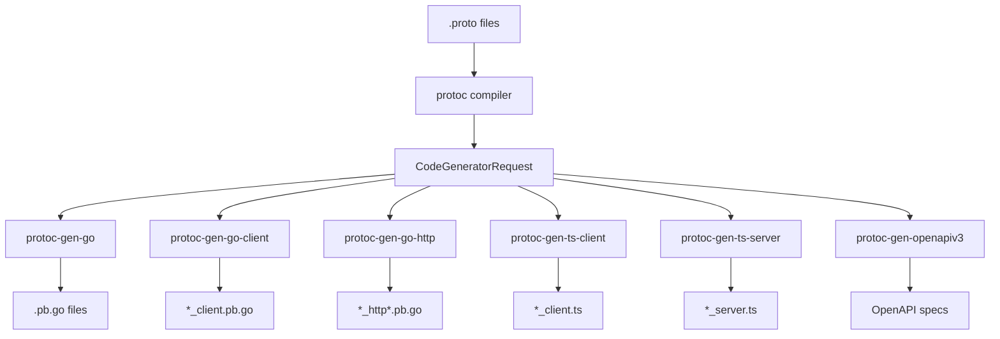

# sebuf Architecture

> Technical deep-dive into the sebuf protobuf toolkit design and implementation

This document provides a comprehensive technical overview of sebuf's architecture, designed for contributors, maintainers, and developers who want to understand how the toolkit works internally.

## Table of Contents

- [System Overview](#system-overview)
- [Plugin Architecture](#plugin-architecture)
- [Code Generation Pipeline](#code-generation-pipeline)
- [Component Deep Dive](#component-deep-dive)
- [Type System](#type-system)
- [Testing Strategy](#testing-strategy)
- [Performance Considerations](#performance-considerations)
- [Extension Points](#extension-points)

## System Overview

sebuf is a collection of five specialized protoc plugins that work together to enable modern HTTP API development from protobuf definitions:

```
┌──────────────────────────────────────────────────────────────────────────────────────────────────┐
│                                        sebuf Toolkit                                              │
├────────────────────┬────────────────────┬────────────────────┬────────────────────┬────────────────────┤
│protoc-gen-go-http  │protoc-gen-go-client│protoc-gen-ts-client│protoc-gen-ts-server│protoc-gen-openapiv3│
│                    │                    │                    │                    │                    │
│ ┌────────────────┐ │ ┌────────────────┐ │ ┌────────────────┐ │ ┌────────────────┐ │ ┌────────────────┐ │
│ │HTTP Handlers   │ │ │Go HTTP Clients │ │ │TS HTTP Clients │ │ │TS HTTP Servers │ │ │  OpenAPI v3.1  │ │
│ │  + Binding     │ │ │  + Type-safe   │ │ │  + Type-safe   │ │ │  + Web Fetch   │ │ │  Specifications│ │
│ │  + Routing     │ │ │  + Functional  │ │ │  + Header help │ │ │  + Framework-  │ │ │  + Validation  │ │
│ │  + Validation  │ │ │    opts        │ │ │  + Error types │ │ │    agnostic    │ │ │  + Headers     │ │
│ └────────────────┘ │ └────────────────┘ │ └────────────────┘ │ └────────────────┘ │ └────────────────┘ │
└────────────────────┴────────────────────┴────────────────────┴────────────────────┴────────────────────┘
                                      │
                                      ▼
┌─────────────────────────────────────────────────────────────────────────────────┐
│                         Standard Go HTTP Stack                                   │
│  ┌─────────────────┐  ┌─────────────────┐  ┌─────────────────────────────────┐  │
│  │    net/http     │  │  Gin/Echo/      │  │  Generated Type-Safe Clients    │  │
│  │                 │  │  Chi/Fiber      │  │  (Direct protobuf integration)  │  │
│  └─────────────────┘  └─────────────────┘  └─────────────────────────────────┘  │
└─────────────────────────────────────────────────────────────────────────────────┘
```

## Plugin Architecture

Each sebuf plugin follows the standard protoc plugin interface while maintaining clean separation of concerns:

### Common Plugin Structure

```go
// All plugins follow this pattern:
func main() {
    // 1. Read CodeGeneratorRequest from stdin
    input := readStdin()
    
    // 2. Parse into protogen structures
    plugin := protogen.New(input)
    
    // 3. Delegate to specialized generator
    generator.Process(plugin)
    
    // 4. Write CodeGeneratorResponse to stdout
    writeStdout(plugin.Response())
}
```

### Plugin Responsibilities

| Plugin | Primary Function | Output | Dependencies |
|--------|-----------------|---------|--------------|
| `protoc-gen-go-http` | Generate HTTP handlers, routing & validation | `*_http*.pb.go` | `protoc-gen-go`, sebuf annotations |
| `protoc-gen-go-client` | Generate type-safe Go HTTP clients | `*_client.pb.go` | `protoc-gen-go`, sebuf annotations |
| `protoc-gen-ts-client` | Generate type-safe TypeScript HTTP clients | `*_client.ts` | sebuf annotations |
| `protoc-gen-ts-server` | Generate framework-agnostic TypeScript HTTP servers | `*_server.ts` | sebuf annotations |
| `protoc-gen-openapiv3` | Generate OpenAPI specifications | `*.yaml`, `*.json` | None (standalone) |

## Code Generation Pipeline

### Phase 1: Protobuf Compilation



### Phase 2: Code Generation Flow

```go
// Simplified generation pipeline
type GenerationPipeline struct {
    input  *pluginpb.CodeGeneratorRequest
    plugin *protogen.Plugin
}

func (p *GenerationPipeline) Process() error {
    // 1. Parse and validate input
    if err := p.parseInput(); err != nil {
        return err
    }
    
    // 2. Process each file
    for _, file := range p.plugin.Files {
        if !file.Generate {
            continue
        }
        
        // 3. Generate code for each component
        if err := p.processFile(file); err != nil {
            return err
        }
    }
    
    return nil
}

func (p *GenerationPipeline) processFile(file *protogen.File) error {
    // File-level processing
    // - Extract metadata
    // - Process services and messages
    // - Generate output files
    return nil
}
```

## Component Deep Dive

### 1. HTTP Handler Generator

**Location**: `internal/httpgen/`

**Architecture**:
```go
type HTTPGenerator struct {
    plugin *protogen.Plugin
}

func (g *HTTPGenerator) Generate() error {
    for _, file := range g.plugin.Files {
        // Generate three types of files:
        // 1. Main HTTP handlers (*_http.pb.go)
        // 2. Request binding logic (*_http_binding.pb.go)  
        // 3. Configuration options (*_http_config.pb.go)
        
        g.generateHTTPFile(file)
        g.generateBindingFile(file)
        g.generateConfigFile(file)
    }
}
```

**Generated Components**:

1. **Service Interface** - Type-safe server contract
2. **Registration Function** - HTTP handler setup
3. **Binding Middleware** - Request/response transformation
4. **Configuration Options** - Customization points

**Request Processing Flow**:
```go
// Generated request processing pipeline
HTTP Request → Content-Type Detection → Binding Middleware → Service Method → Response Marshaling → HTTP Response
```

### 2. HTTP Client Generator

**Location**: `internal/clientgen/`

**Architecture**:
```go
type Generator struct {
    plugin *protogen.Plugin
}

func (g *Generator) Generate() error {
    for _, file := range g.plugin.Files {
        // Generate client file for services
        // *_client.pb.go with interface and implementation
        g.generateClientFile(file)
    }
}
```

**Generated Components**:

1. **Client Interface** - Type-safe client contract
2. **Client Implementation** - HTTP client with request/response handling
3. **Client Options** - Functional options for configuration
4. **Call Options** - Per-request customization options
5. **Header Helpers** - Generated from service/method header annotations

**Request Flow**:
```go
// Generated client request pipeline
Method Call → Build URL → Apply Headers → Serialize Body → HTTP Request → Deserialize Response → Return
```

**Key Features**:
- Functional options pattern for client configuration
- Per-call options for request customization
- Automatic path parameter substitution
- Query parameter encoding for GET/DELETE
- JSON and protobuf content type support
- Typed error handling with `ClientError`

### 3. TypeScript Client Generator

**Location**: `internal/tsclientgen/`

**Architecture**:
```go
type Generator struct {
    plugin *protogen.Plugin
}

func (g *Generator) Generate() error {
    for _, file := range g.plugin.Files {
        // Generate TypeScript client file for services
        // *_client.ts with interfaces, client class, and error types
        g.generateClientFile(file)
    }
}
```

**Generated Components**:

1. **TypeScript Interfaces** - Typed request/response interfaces from protobuf messages
2. **Client Class** - `{Service}Client` with methods for each RPC
3. **Client Options** - Constructor options for base URL, headers, API keys, custom fetch
4. **Call Options** - Per-request headers, abort signals, and method-specific header helpers
5. **Error Types** - `ValidationError` (with field violations) and `ApiError` (with status code)

**Key Features**:
- Full protobuf-to-TypeScript type mapping (scalars, enums, repeated, maps, nested messages)
- Automatic path parameter substitution from request fields
- Query parameter encoding for GET/DELETE methods with null-safe zero-value checks
- Service-level headers (e.g., `apiKey` from `X-API-Key`) as constructor options
- Method-level headers (e.g., `requestId` from `X-Request-ID`) as call options
- Structured error handling with `ValidationError` and `ApiError` classes
- Zero runtime dependencies — uses only the Fetch API

### 4. TypeScript Server Generator

**Location**: `internal/tsservergen/`

**Architecture**:
```go
type Generator struct {
    plugin *protogen.Plugin
}

func (g *Generator) Generate() error {
    for _, file := range g.plugin.Files {
        // Generate TypeScript server file for services
        // *_server.ts with handler interface, route descriptors, and context types
        g.generateServerFile(file)
    }
}
```

**Generated Components**:

1. **Handler Interface** - `{Service}Handler` with methods for each RPC (like Go's `{Service}Server`)
2. **Route Descriptors** - `RouteDescriptor[]` with method, path, and handler function
3. **Route Factory** - `create{Service}Routes(handler, options)` wires handler to routes
4. **Server Context** - `ServerContext` with headers, path params, and raw request
5. **TypeScript Interfaces** - Typed request/response interfaces (shared via `tscommon`)
6. **Error Types** - `ValidationError` and `ApiError` (shared via `tscommon`)
7. **Proto-defined Error Interfaces** - TypeScript interfaces for proto messages ending with "Error" (e.g., `NotFoundError`, `LoginError`)

**Key Features**:
- Framework-agnostic: uses Web Fetch API (`Request` → `Promise<Response>`)
- Works natively in Node 18+, Deno, Bun, Cloudflare Workers
- Path parameter extraction and merge into request body
- Header validation with type/format checking
- Query parameter parsing for GET/DELETE methods
- Generation-time validation (unmatched path params, unreachable fields)
- `onError` hook for custom error responses
- Proto-defined custom errors: any message ending with "Error" generates a TypeScript interface, mirroring Go's automatic error interface convention

### 5. OpenAPI Generator

**Location**: `internal/openapiv3/`

**Document Structure**:
```go
type Generator struct {
    doc     *v3.Document    // OpenAPI document
    schemas *SchemaMap      // Component schemas
    format  OutputFormat    // YAML or JSON
}

func (g *Generator) ProcessFile(file *protogen.File) {
    // 1. Extract document metadata
    g.updateDocumentInfo(file)

    // 2. Process all messages → schemas
    for _, message := range file.Messages {
        g.processMessage(message)
    }

    // 3. Process all services → paths
    for _, service := range file.Services {
        g.processService(service)
    }
}
```

**Type Mapping System**:
```go
func (g *Generator) convertField(field *protogen.Field) *Schema {
    switch {
    case field.Desc.IsList():
        return g.createArraySchema(field)
    case field.Desc.IsMap():
        return g.createMapSchema(field)
    case field.Message != nil:
        return g.createMessageReference(field)
    default:
        return g.convertScalarType(field)
    }
}
```

## Type System

sebuf implements a comprehensive type mapping system that handles the full spectrum of protobuf types:

### Scalar Type Mapping

| Protobuf Type | Go Type | TypeScript Type | OpenAPI Type | JSON Type |
|---------------|---------|-----------------|--------------|-----------|
| `string` | `string` | `string` | `string` | `string` |
| `int32` | `int32` | `number` | `integer/int32` | `number` |
| `int64` | `int64` | `string` | `integer/int64` | `string` |
| `bool` | `bool` | `boolean` | `boolean` | `boolean` |
| `bytes` | `[]byte` | `string` | `string/byte` | `string` (base64) |
| `double` | `float64` | `number` | `number/double` | `number` |
| `enum` | `int32` | `string` (union) | `string` | `string` |

### Complex Type Handling

**Repeated Fields (Arrays)**:
```protobuf
repeated string tags = 1;
```
```go
// Go: []string
// OpenAPI: {"type": "array", "items": {"type": "string"}}
```

**Map Fields**:
```protobuf
map<string, string> metadata = 1;
```
```go
// Go: map[string]string  
// OpenAPI: {"type": "object", "additionalProperties": {"type": "string"}}
```

**Message References**:
```protobuf
User user = 1;
```
```go
// Go: *User
// OpenAPI: {"$ref": "#/components/schemas/User"}
```

**Oneof Fields**:
```protobuf
oneof auth_method {
  EmailAuth email = 1;
  TokenAuth token = 2;
}
```
```go
// Manual construction:
req := &LoginRequest{
  AuthMethod: &LoginRequest_Email{Email: &EmailAuth{...}},
}
```

## Testing Strategy

sebuf employs a multi-layered testing approach to ensure reliability:

### 1. Golden File Testing

**Purpose**: Detect unintended changes in generated code
**Location**: `internal/*/testdata/`

```go
func TestExhaustiveGoldenFiles(t *testing.T) {
    testCases := []string{
        "simple_service",
        "complex_service", 
        "nested_types",
    }
    
    for _, testCase := range testCases {
        t.Run(testCase, func(t *testing.T) {
            // Generate code from test proto
            generated := generateCode(testCase + ".proto")
            
            // Compare with golden file
            golden := readGoldenFile(testCase + ".openapi.yaml")
            assert.Equal(t, golden, generated)
        })
    }
}
```

### 2. Unit Testing

**Purpose**: Test individual functions and components
**Coverage**: 85%+ target

```go
func TestFieldTypeMapping(t *testing.T) {
    tests := []struct {
        field    *protogen.Field
        expected string
    }{
        {stringField, "string"},
        {repeatedStringField, "[]string"},
        {mapField, "map[string]string"},
    }
    // Test implementation...
}
```

### 3. Integration Testing

**Purpose**: Test complete workflows end-to-end

```go
func TestHTTPGenerationWorkflow(t *testing.T) {
    // 1. Create test proto file
    protoContent := `...`
    
    // 2. Run protoc with sebuf plugins
    runProtoc(protoContent)
    
    // 3. Compile generated Go code
    compileGenerated()
    
    // 4. Test HTTP endpoints
    testEndpoints()
}
```

### Test Data Organization

```
internal/openapiv3/testdata/           # OpenAPI generator tests
├── proto/                               # Input proto files
│   ├── simple_service.proto
│   ├── complex_service.proto
│   └── nested_types.proto
└── golden/                              # Expected outputs
    ├── SimpleService.openapi.yaml
    ├── ComplexService.openapi.yaml
    └── NestedTypesService.openapi.yaml

internal/tsclientgen/testdata/         # TypeScript client generator tests
├── proto/                               # Input proto files (symlinks to shared protos)
│   ├── query_params.proto
│   ├── http_verbs_comprehensive.proto
│   └── backward_compat.proto
└── golden/                              # Expected outputs
    ├── query_params_client.ts
    ├── http_verbs_comprehensive_client.ts
    └── backward_compat_client.ts
```

## Performance Considerations

### Memory Management

**Efficient Protogen Usage**:
```go
// ✅ Good: Process files sequentially
for _, file := range plugin.Files {
    if !file.Generate {
        continue // Skip non-target files
    }
    processFile(file)
}

// ❌ Avoid: Loading all files into memory
allFiles := loadAllFiles(plugin.Files) // Memory intensive
```

**String Building Optimization**:
```go
// ✅ Good: Use GeneratedFile for output
g.P("func ", functionName, "(", parameters, ") {")
g.P("    return &", structName, "{")
g.P("        Field: value,")
g.P("    }")
g.P("}")

// ❌ Avoid: String concatenation
result := "func " + functionName + "(" + parameters + ") {\n" + ...
```

### Generation Speed

**Benchmarks** (for reference):
- Simple service (5 methods): ~2ms
- Complex service (20 methods, nested types): ~15ms
- Large API (100+ methods): ~100ms

**Optimization Strategies**:
1. **Lazy Evaluation** - Only process files marked for generation
2. **Incremental Generation** - Cache unchanged components
3. **Parallel Processing** - Independent files can be processed concurrently

## Extension Points

sebuf is designed to be extensible for future enhancements:

### 1. New Plugin Types

**Adding a New Generator**:
```go
// cmd/protoc-gen-new-feature/main.go
func main() {
    protogen.Options{}.Run(func(gen *protogen.Plugin) error {
        // Your custom generation logic
        return newfeature.Generate(gen)
    })
}
```

### 2. Custom Annotations

**Extending HTTP Annotations**:
```protobuf
// proto/sebuf/http/annotations.proto
extend google.protobuf.MethodOptions {
  AuthConfig auth_config = 50005;  // New annotation
}

message AuthConfig {
  repeated string required_roles = 1;
  bool require_authentication = 2;
}
```

### 3. Framework Integrations

**Plugin Interface for Frameworks**:
```go
type FrameworkAdapter interface {
    GenerateHandlers(service *protogen.Service) error
    GenerateMiddleware(options MiddlewareOptions) error
    GenerateRouting(paths []HTTPPath) error
}

// Implementations:
type GinAdapter struct{}
type EchoAdapter struct{}
type ChiAdapter struct{}
```

### 4. Output Format Extensions

**Adding New Output Formats**:
```go
type OutputFormat string

const (
    FormatYAML     OutputFormat = "yaml"
    FormatJSON     OutputFormat = "json"
    FormatTypeScript OutputFormat = "typescript"  // New format
)
```

## Design Principles

### 1. Separation of Concerns

Each plugin has a single, well-defined responsibility:
- **HTTP Generator**: Go HTTP server handlers and validation
- **Go Client Generator**: Go HTTP client generation
- **TypeScript Client Generator**: TypeScript HTTP client generation
- **TypeScript Server Generator**: TypeScript HTTP server generation
- **OpenAPI Generator**: Documentation generation only

### 2. Zero Runtime Dependencies

Generated code has no sebuf runtime dependencies:
- Uses only standard Go libraries
- Compatible with any HTTP framework
- No vendor lock-in

### 3. Backwards Compatibility

- Generated code is stable across sebuf versions
- API changes follow semantic versioning
- Migration guides for breaking changes

### 4. Developer Experience

- Clear error messages with actionable guidance
- Comprehensive documentation and examples
- Predictable generation patterns

## Future Enhancements

### Planned Features

1. **Advanced HTTP Features**
   - Custom middleware generation
   - Authentication/authorization integration
   - Rate limiting support

2. **Additional Output Formats**
   - ~~TypeScript client generation~~ (shipped: `protoc-gen-ts-client`)
   - ~~TypeScript server generation~~ (shipped: `protoc-gen-ts-server`)
   - Swagger/OpenAPI 2.0 support
   - GraphQL schema generation

3. **Performance Optimizations**
   - Incremental compilation
   - Parallel generation
   - Memory usage optimization

4. **Enhanced Tooling**
   - IDE integration
   - Live reload during development
   - Configuration validation

---

This architecture enables sebuf to provide a cohesive, yet modular toolkit for modern protobuf-to-HTTP development while maintaining flexibility for future enhancements and integrations.